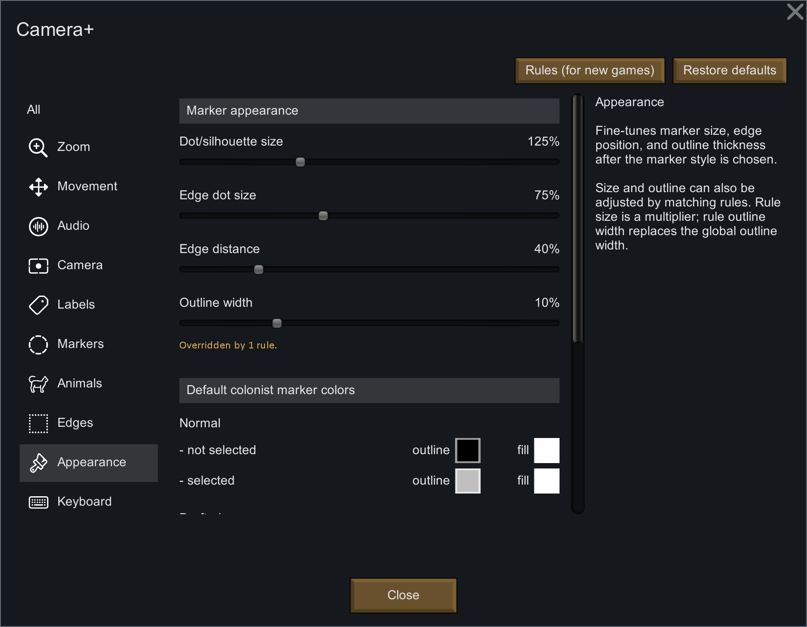

# Camera+ Mod for RimWorld

Welcome to Camera+!

Camera+ extends RimWorld's camera zoom range, camera movement, and far-zoom marker rendering. It lets you zoom in for detail, zoom out for a strategic map view, tune movement at both ends of the zoom range, and replace far-away pawns with readable dots, silhouettes, edge indicators, or custom marker graphics.

## Settings Overview

Camera+ settings are organized by topic. Use **All** to see everything at once, or pick a left-side topic such as **Zoom**, **Movement**, **Audio**, **Camera**, **Labels**, **Markers**, **Animals**, **Edges**, **Appearance**, or **Keyboard** for a shorter page.

### Zoom
- **Maximum zoomed in factor**: Adjusts how close you can zoom in.
- **Maximum zoomed out factor**: Adjusts how far you can zoom out.
- **Exponential zoom speed**: Controls how the mouse wheel travels through the zoom range.

### Movement
- **Scroll speed for highest zoom factor**: Defines movement speed when fully zoomed in.
- **Scroll speed for lowest zoom factor**: Defines movement speed when fully zoomed out.
- **Edge scroll factor for highest zoom factor**: Adjusts screen-edge scroll speed when fully zoomed in.
- **Edge scroll factor for lowest zoom factor**: Adjusts screen-edge scroll speed when fully zoomed out.

### Camera, Audio, and Labels
- **Zoom to mouse**: Keeps the map point under the cursor stable while zooming.
- **Disable camera shake**: Suppresses vanilla camera shake effects.
- **Bring distant sounds closer**: Makes map sounds feel closer when using far zoom levels.
- **Mouse reveals labels**: Temporarily restores hidden labels near the mouse.
- **Hide pawn labels below / hide stack labels below / hide dead pawns below**: Reduces far-zoom label and body clutter based on screen-cell size.

## Keyboard Shortcuts
Defaults:
- **Camera+ settings**: `Left Shift` + `Tab`
- **Load view**: `Left Shift` + `1-9`
- **Save view**: `Left Alt` + `1-9`

The settings shortcut has a configurable main key and modifiers. Loading and saving views always use number keys 1 through 9 with configurable modifiers.

## Dot Style
- **Vanilla default**: Original game markers for a familiar look.
- **Camera+ dots**: Custom dot markers for pawns, making it easy to differentiate between types.
- **Camera+ silhouettes**: Enhanced customizable silhouettes for a clearer visual representation.
- **Show as marker below**: Defines when Camera+ starts replacing pawn bodies with markers.

## Animal Markers
- **Animals have the same marker**: Consistent markers for all animals.
- **Animals have a different marker**: Different markers for different animals.
- **Animals have no marker**: Removes markers from animals.
- **Include untamed animals**: Toggles marker for untamed animals, keeping your wild fauna in check.
- **Dot/silhouette size, edge dot size, edge distance, and outline width**: Adjust marker appearance and edge-indicator placement.

## Rules and Customization
### Dot Style Rules
- Add rules to customize pawn markers based on conditions.
- Combine tags to form "AND" conditions for precise control.
- Customize mode, colors, map markers, edge markers, mouse reveal behavior, marker threshold, size, and outline width for each rule.

### Adding Conditions
- Use the "+" button to add tags, allowing you to create detailed rules for marker customization. The first rule that matches defines the marker style and sets the custom settings.
- Some tags have editable text parameters for even more specific conditions:

### Tags
- **Types**: e.g., Animal, Human, Mechanoid to categorize pawns.
- **Attributes**: e.g., Attacking, Drafted, Injured to specify states and behaviors.
- **Naming**: e.g., Faction, Weapon to target specific names and types.

## Saving and Loading Customizations
- Save and load marker-rule presets from the `CameraPlus` folder under RimWorld's save-data directory.

## Custom Marker Graphics
- Place custom marker graphics (`.png` files) in the same `CameraPlus` save-data folder.
- These files will be available in the "Mode" column context menu, allowing you to apply your custom graphics.

For detailed configuration, use the in-game settings menu and its help panel.

Powered by [Harmony](https://github.com/pardeike/Harmony)
The runtime patch library for Unity
